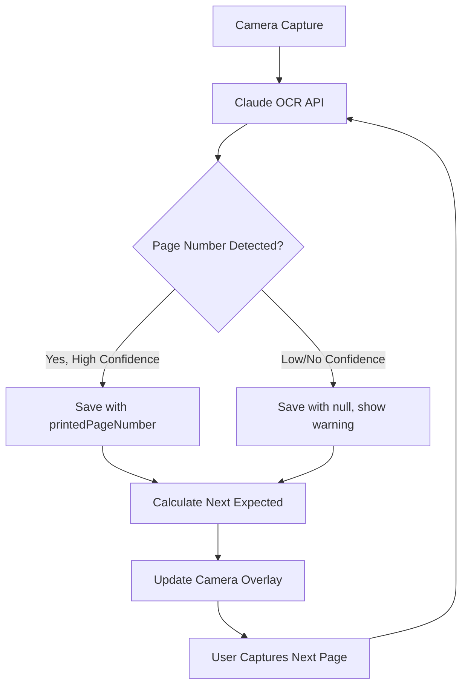
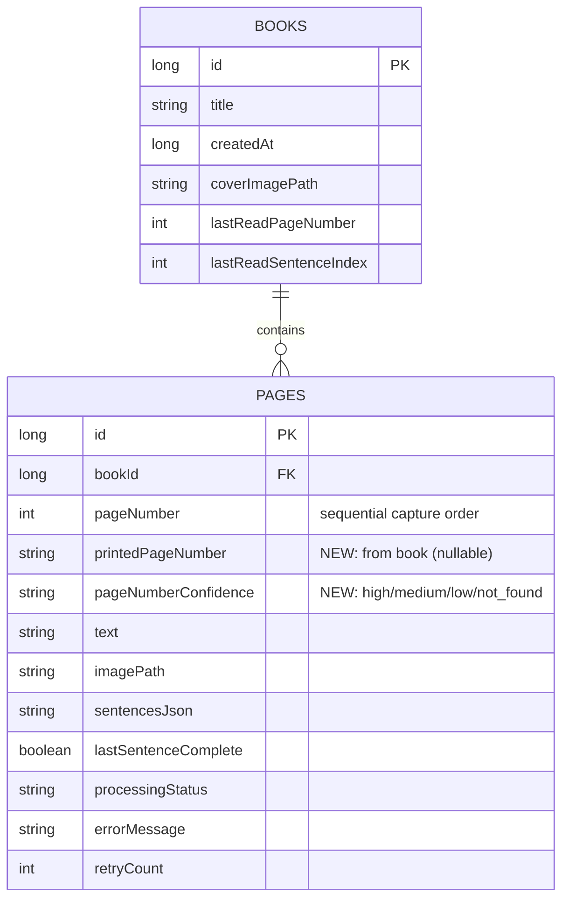

# feat: Track and Display Printed Book Page Numbers

**Date:** 2025-12-08
**Type:** Enhancement
**Priority:** High

## Overview

Add the ability to extract, store, and display the **printed page numbers** from book pages (the numbers actually printed in the book) during camera capture. Display the expected next page number prominently on the camera screen so users know which page to capture next.

## Problem Statement

Currently, the app tracks pages by sequential capture order (1, 2, 3...) but not by the page numbers actually printed in the book. Users have no guidance about which page they should capture next, making it difficult to:
- Resume scanning a book mid-session
- Verify they haven't skipped pages
- Know where they are in the physical book

## Proposed Solution

1. **Enhance OCR** to extract printed page numbers alongside sentence text
2. **Store page metadata** in the database (printed number, confidence level)
3. **Display prominently** the next expected page number during camera capture
4. **Validate sequences** and warn about gaps or mismatches

---

## Technical Approach

### Architecture



### Database Schema Changes



---

## Implementation Phases

### Phase 1: Database & OCR Foundation

**Estimated Effort:** Core infrastructure changes

#### 1.1 Database Migration (v4 → v5)

**File:** [AppDatabase.kt](app/src/main/java/com/example/arlo/data/AppDatabase.kt)

```kotlin
// MIGRATION_4_5: Add printed page number tracking
private val MIGRATION_4_5 = object : Migration(4, 5) {
    override fun migrate(database: SupportSQLiteDatabase) {
        // Nullable string to handle Roman numerals (i, ii, iii) and Arabic (1, 2, 3)
        database.execSQL("ALTER TABLE pages ADD COLUMN printedPageNumber TEXT")
        // Confidence level for OCR detection
        database.execSQL("ALTER TABLE pages ADD COLUMN pageNumberConfidence TEXT")
    }
}
```

#### 1.2 Update Page Entity

**File:** [Page.kt](app/src/main/java/com/example/arlo/data/Page.kt)

```kotlin
@Entity(tableName = "pages", ...)
data class Page(
    // ... existing fields ...
    val pageNumber: Int,                           // Sequential capture order (unchanged)
    val printedPageNumber: String? = null,         // NEW: "47", "viii", etc.
    val pageNumberConfidence: String? = null,      // NEW: "high", "medium", "low", "not_found"
    // ... rest of fields ...
) {
    /**
     * Parse printed page number as Int for calculations.
     * Handles Arabic numerals and Roman numerals.
     */
    fun printedPageNumberAsInt(): Int? {
        return printedPageNumber?.let {
            it.toIntOrNull() ?: romanToInt(it)
        }
    }

    private fun romanToInt(roman: String): Int? {
        // Implementation for i, ii, iii, iv, v, vi, vii, viii, ix, x, etc.
    }
}
```

#### 1.3 Enhance OCR Prompt

**File:** [ClaudeOCRService.kt](app/src/main/java/com/example/arlo/ml/ClaudeOCRService.kt)

```kotlin
private val OCR_PROMPT = """
Extract all text from this book page image. Return a JSON object with this exact format:
{
  "printedPageNumber": "47",
  "pageNumberConfidence": "high",
  "sentences": [
    {"text": "First sentence.", "isComplete": true},
    {"text": "Last sentence that may be cut", "isComplete": false}
  ]
}

Page Number Rules:
- Look for the page number in header (top corners) or footer (bottom center/corners)
- Return the actual printed number as a string (e.g., "47", "viii", "A-12")
- Set confidence to "high" (clearly visible), "medium" (partially visible), "low" (uncertain), or "not_found"
- If no page number is visible (e.g., chapter start pages), set printedPageNumber to null and confidence to "not_found"

Sentence Rules:
- Split text into sentences ending with . ! or ?
- IGNORE periods in abbreviations (Dr., Mr., Mrs., U.S., etc.)
- The LAST sentence should have isComplete: false ONLY if it ends mid-thought
- Return ONLY the JSON object, no other text
""".trimIndent()
```

#### 1.4 Update OCRResult Data Class

**File:** [ClaudeOCRService.kt](app/src/main/java/com/example/arlo/ml/ClaudeOCRService.kt)

```kotlin
data class OCRResult(
    val sentences: List<SentenceData>,
    val fullText: String,
    val printedPageNumber: String? = null,           // NEW
    val pageNumberConfidence: String = "not_found"   // NEW
)
```

---

### Phase 2: Camera UI Enhancement

**Estimated Effort:** UI/UX implementation

#### 2.1 Add Large Page Number Overlay

**File:** [fragment_camera.xml](app/src/main/res/layout/fragment_camera.xml)

Add new overlay below existing instruction card:

```xml
<!-- Large page number display -->
<LinearLayout
    android:id="@+id/pageNumberOverlay"
    android:layout_width="0dp"
    android:layout_height="wrap_content"
    android:layout_marginHorizontal="24dp"
    android:layout_marginTop="8dp"
    android:background="@drawable/bg_page_number_overlay"
    android:gravity="center"
    android:orientation="vertical"
    android:paddingHorizontal="32dp"
    android:paddingVertical="24dp"
    android:visibility="gone"
    app:layout_constraintEnd_toEndOf="parent"
    app:layout_constraintStart_toStartOf="parent"
    app:layout_constraintTop_toBottomOf="@id/instructionCard"
    tools:visibility="visible">

    <TextView
        android:id="@+id/tvNextPageLabel"
        android:layout_width="wrap_content"
        android:layout_height="wrap_content"
        android:fontFamily="serif"
        android:text="Scan page"
        android:textColor="@color/white"
        android:textSize="16sp" />

    <TextView
        android:id="@+id/tvNextPageNumber"
        android:layout_width="wrap_content"
        android:layout_height="wrap_content"
        android:fontFamily="serif"
        android:text="47"
        android:textColor="@color/white"
        android:textSize="64sp"
        android:textStyle="bold" />

</LinearLayout>
```

#### 2.2 Create Overlay Background Drawable

**File:** `res/drawable/bg_page_number_overlay.xml` (NEW)

```xml
<?xml version="1.0" encoding="utf-8"?>
<shape xmlns:android="http://schemas.android.com/apk/res/android"
    android:shape="rectangle">
    <solid android:color="#E68B3A3A" />
    <corners android:radius="16dp" />
</shape>
```

#### 2.3 Update CameraFragment UI Logic

**File:** [CameraFragment.kt](app/src/main/java/com/example/arlo/CameraFragment.kt)

```kotlin
private fun updateUIForStep() {
    when (captureStep) {
        CaptureStep.COVER -> {
            // ... existing cover logic ...
            binding.pageNumberOverlay.visibility = View.GONE
        }
        CaptureStep.PAGE -> {
            // ... existing page logic ...
            updatePageNumberOverlay()
        }
        CaptureStep.PREVIEW -> {
            // ... existing preview logic ...
            binding.pageNumberOverlay.visibility = View.GONE
        }
    }
}

private fun updatePageNumberOverlay() {
    viewLifecycleOwner.lifecycleScope.launch {
        val expectedPage = viewModel.getExpectedNextPageNumber(currentBookId)

        if (expectedPage != null) {
            binding.pageNumberOverlay.visibility = View.VISIBLE
            binding.tvNextPageNumber.text = expectedPage

            // Speak the page number
            if ((requireActivity().application as ArloApplication).ttsService.isReady()) {
                speakPageNumber(expectedPage)
            }
        } else {
            // First page or no prior pages
            binding.pageNumberOverlay.visibility = View.GONE
        }
    }
}

private fun speakPageNumber(pageNumber: String) {
    val tts = (requireActivity().application as ArloApplication).ttsService
    tts.speak("Scan page $pageNumber")
}
```

---

### Phase 3: Repository & ViewModel Updates

**Estimated Effort:** Business logic integration

#### 3.1 Add DAO Methods

**File:** [BookDao.kt](app/src/main/java/com/example/arlo/data/BookDao.kt)

```kotlin
@Query("SELECT printedPageNumber FROM pages WHERE bookId = :bookId AND processingStatus = 'COMPLETED' ORDER BY pageNumber DESC LIMIT 1")
suspend fun getLastPrintedPageNumber(bookId: Long): String?

@Query("UPDATE pages SET printedPageNumber = :printedPageNumber, pageNumberConfidence = :confidence WHERE id = :pageId")
suspend fun updatePrintedPageNumber(pageId: Long, printedPageNumber: String?, confidence: String)
```

#### 3.2 Add Repository Methods

**File:** [BookRepository.kt](app/src/main/java/com/example/arlo/data/BookRepository.kt)

```kotlin
/**
 * Calculate expected next page number based on last captured page.
 * Returns null if no prior pages or no printed page numbers detected.
 */
suspend fun getExpectedNextPageNumber(bookId: Long): String? {
    val lastPrinted = bookDao.getLastPrintedPageNumber(bookId) ?: return null

    // Try to increment as integer
    val lastInt = lastPrinted.toIntOrNull()
    if (lastInt != null) {
        return (lastInt + 1).toString()
    }

    // Try Roman numeral increment
    val lastRoman = romanToInt(lastPrinted)
    if (lastRoman != null) {
        return intToRoman(lastRoman + 1)
    }

    // Can't determine next page number
    return null
}

/**
 * Validate detected page number against expected.
 * Returns validation result with appropriate action.
 */
suspend fun validatePageNumber(
    bookId: Long,
    detected: String?,
    confidence: String
): PageNumberValidation {
    val expected = getExpectedNextPageNumber(bookId)

    return when {
        detected == null -> PageNumberValidation.NotDetected
        expected == null -> PageNumberValidation.FirstPage(detected)
        detected == expected -> PageNumberValidation.Match(detected)
        else -> {
            val gap = calculateGap(expected, detected)
            when {
                gap in -2..2 -> PageNumberValidation.MinorMismatch(expected, detected, gap)
                gap > 2 -> PageNumberValidation.GapDetected(expected, detected, gap)
                else -> PageNumberValidation.BackwardJump(expected, detected)
            }
        }
    }
}

sealed class PageNumberValidation {
    object NotDetected : PageNumberValidation()
    data class FirstPage(val detected: String) : PageNumberValidation()
    data class Match(val pageNumber: String) : PageNumberValidation()
    data class MinorMismatch(val expected: String, val detected: String, val gap: Int) : PageNumberValidation()
    data class GapDetected(val expected: String, val detected: String, val gap: Int) : PageNumberValidation()
    data class BackwardJump(val expected: String, val detected: String) : PageNumberValidation()
}
```

#### 3.3 Update CameraViewModel

**File:** [CameraViewModel.kt](app/src/main/java/com/example/arlo/CameraViewModel.kt)

```kotlin
/**
 * Get expected next page number for camera overlay display.
 */
suspend fun getExpectedNextPageNumber(bookId: Long): String? {
    return repository.getExpectedNextPageNumber(bookId)
}

/**
 * Process OCR result with page number validation.
 */
fun processPageWithValidation(
    bookId: Long,
    imageUri: Uri,
    onValidation: (BookRepository.PageNumberValidation) -> Unit,
    onResult: (OCRResult) -> Unit
) {
    // ... existing OCR processing ...
    // Add validation step before saving
}
```

---

### Phase 4: Validation & Error Handling

**Estimated Effort:** Edge case handling

#### 4.1 Page Number Mismatch Dialog

**File:** [CameraFragment.kt](app/src/main/java/com/example/arlo/CameraFragment.kt)

```kotlin
private fun showPageMismatchDialog(
    expected: String,
    detected: String,
    gap: Int,
    onAccept: () -> Unit,
    onRetry: () -> Unit,
    onEdit: (String) -> Unit
) {
    MaterialAlertDialogBuilder(requireContext())
        .setTitle("Page Number Mismatch")
        .setMessage("Expected page $expected, but detected page $detected.\n\nSkipped ${abs(gap)} page(s)?")
        .setPositiveButton("Accept $detected") { _, _ -> onAccept() }
        .setNegativeButton("Retake Photo") { _, _ -> onRetry() }
        .setNeutralButton("Edit") { _, _ -> showManualEntryDialog(detected, onEdit) }
        .setCancelable(false)
        .show()
}

private fun showManualEntryDialog(
    currentValue: String?,
    onConfirm: (String) -> Unit
) {
    val input = EditText(requireContext()).apply {
        setText(currentValue ?: "")
        hint = "Enter page number"
        inputType = InputType.TYPE_CLASS_TEXT
    }

    MaterialAlertDialogBuilder(requireContext())
        .setTitle("Enter Page Number")
        .setView(input)
        .setPositiveButton("Save") { _, _ -> onConfirm(input.text.toString()) }
        .setNegativeButton("Cancel", null)
        .show()
}
```

#### 4.2 Handle Low Confidence Detection

```kotlin
private fun handleLowConfidenceDetection(
    detected: String?,
    confidence: String,
    onContinue: () -> Unit
) {
    if (confidence == "low" || confidence == "not_found") {
        Snackbar.make(
            binding.root,
            "Page number unclear - tap to edit",
            Snackbar.LENGTH_LONG
        ).setAction("Edit") {
            showManualEntryDialog(detected) { edited ->
                // Update with manually entered page number
            }
        }.show()
    }
    onContinue()
}
```

---

## Acceptance Criteria

### Functional Requirements

- [ ] OCR extracts printed page numbers from book images
- [ ] Page numbers stored in database with confidence level
- [ ] Camera overlay displays expected next page number (64sp, prominent)
- [ ] TTS announces "Scan page X" when entering page capture mode
- [ ] System warns on page number gaps > 2 pages
- [ ] Users can manually edit detected page numbers
- [ ] Roman numerals (i, ii, iii...) are supported

### Non-Functional Requirements

- [ ] Page number detection accuracy > 90% on clear images
- [ ] Overlay text readable from arm's length (64sp minimum)
- [ ] No breaking changes to existing books (migration is additive)
- [ ] Database migration completes in < 1 second

### Quality Gates

- [ ] All existing tests pass
- [ ] Manual testing on Fire Tablet
- [ ] Migration tested with existing book data

---

## Success Metrics

1. **Accuracy:** > 90% correct page number detection on sample books
2. **Usability:** Users can see overlay number without squinting
3. **Reliability:** No crashes during page capture flow
4. **Compatibility:** Existing books continue to work without data loss

---

## Dependencies & Prerequisites

- **Claude Haiku API:** Must support structured output for page number extraction
- **Room 2.6.1:** Already in use, supports migrations
- **Material Components 1.11.0:** For dialogs and snackbars
- **Existing Files:**
  - [ClaudeOCRService.kt](app/src/main/java/com/example/arlo/ml/ClaudeOCRService.kt) - OCR prompt changes
  - [Page.kt](app/src/main/java/com/example/arlo/data/Page.kt) - Entity update
  - [AppDatabase.kt](app/src/main/java/com/example/arlo/data/AppDatabase.kt) - Migration
  - [CameraFragment.kt](app/src/main/java/com/example/arlo/CameraFragment.kt) - UI overlay
  - [fragment_camera.xml](app/src/main/res/layout/fragment_camera.xml) - Layout changes

---

## Risk Analysis & Mitigation

| Risk | Probability | Impact | Mitigation |
|------|-------------|--------|------------|
| OCR misreads page numbers | Medium | Medium | Allow manual editing, show confidence indicator |
| Roman numerals not parsed | Low | Low | Store as string, provide parsing utility |
| Users skip validation dialogs | Medium | Low | Make dialogs non-dismissible, require action |
| Migration breaks existing data | Low | High | Nullable columns, thorough testing |
| Performance impact from new fields | Low | Low | Indexed queries, lazy loading |

---

## Future Considerations

1. **Batch editing:** Allow users to fix multiple page numbers at once
2. **Jump to page:** Search by printed page number
3. **Smart gap detection:** Infer missing pages and prompt to scan them
4. **Chapter detection:** Use page number patterns to identify chapters
5. **Re-OCR existing books:** Background task to add page numbers to old captures

---

## References

### Internal References
- Current OCR Prompt: [ClaudeOCRService.kt:264-293](app/src/main/java/com/example/arlo/ml/ClaudeOCRService.kt#L264-L293)
- Current Page Entity: [Page.kt:20-32](app/src/main/java/com/example/arlo/data/Page.kt#L20-L32)
- Camera Fragment Flow: [CameraFragment.kt:184-403](app/src/main/java/com/example/arlo/CameraFragment.kt#L184-L403)
- Database Migrations: [AppDatabase.kt:20-44](app/src/main/java/com/example/arlo/data/AppDatabase.kt#L20-L44)
- Camera Layout: [fragment_camera.xml:40-87](app/src/main/res/layout/fragment_camera.xml#L40-L87)

### External References
- [Room Database Migrations](https://developer.android.com/training/data-storage/room/migrating-db-versions)
- [Material Design 3 Typography](https://m3.material.io/styles/typography/applying-type)
- [Claude Structured Outputs](https://platform.claude.com/docs/en/build-with-claude/structured-outputs)
- [Header and Footer Extraction Research](https://www.researchgate.net/publication/221253782_Header_and_Footer_Extraction_by_Page-Association)
- [Nielsen Norman Group: Mobile Instructional Overlays](https://www.nngroup.com/articles/mobile-instructional-overlay/)
